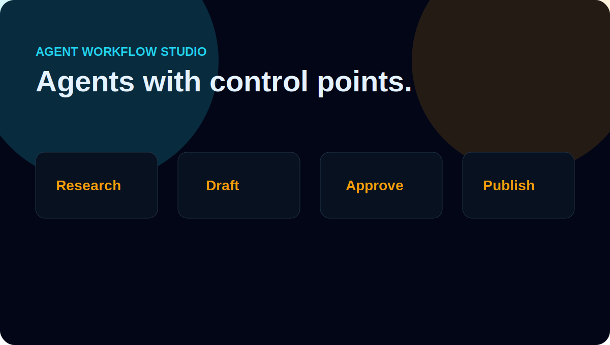

<div align="center">

# Agent Workflow Studio


Planner, tools, memory, approval, retries, and logs.

[Live demo](https://abdulazizbalu.github.io/agent-workflow-studio/)

</div>



## Features

- task planner
- tool registry
- memory store
- human approval gate
- retry policy
- execution logs
- deterministic tests

## Run

```bash
npm test
npm run demo
```

